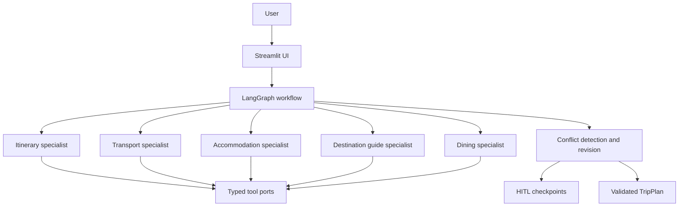

# AI Trip Planner

A single-user, multi-agent travel workspace. Describe a trip, and five specialists work on it in
parallel under a LangGraph orchestrator that checks their proposals against each other, re-plans what
conflicts, and escalates anything it cannot resolve.

One of them is an agent in the strict sense: the supervisor, which decides *who* works. Three are
single structured generations (day plan, guide, dining) and two are deterministic calculators
(transport, accommodation) that no model is allowed to price. What holds them together — conflict
detection, the budget rules and the stopping condition — is deterministic, not negotiated.

Python 3.11+ · LangChain · LangGraph · Pydantic · Streamlit

## Architecture



A supervisor agent chooses *which* specialists to call, through one tool each. It cannot
touch the validated brief, the memory store or the tool gateway — those arrive in the run context
the graph constructs, never from the model — so its only freedom is delegation, never the trip
facts. When no model is configured, or the loop fails, dispatch falls back to running every
specialist deterministically.

LangGraph owns state, conflict checks, the round limit and escalation. The specialists own
role-specific reasoning and tool selection. That split is deliberate: budget red lines and the
stopping condition should not depend on a model improvising the next step.

| Specialist | Section | Reasoning |
| --- | --- | --- |
| `itinerary` | Day plan | Model, grounded in map candidates |
| `transport` | Getting around | Deterministic calculator over booking and maps |
| `accommodation` | Stay | Deterministic calculator over booking |
| `destination-guide` | Destination guide | Model, grounded in map candidates |
| `dining` | Food and dining | Model, grounded in map candidates |

Transport and accommodation are deliberately deterministic: a model may narrate a stay, but it
never prices one.

## Quick start

```bash
uv sync
uv run streamlit run streamlit_app.py     # http://localhost:8501
uv run pytest
uv run ruff check .
```

It runs with no API keys and no network. Every specialist falls back to deterministic output and
the tool ports serve fixtures, so the whole loop — dispatch, conflict detection, revision and
escalation — is exercised offline. Copy `.env.example` to `.env` to add live models.

`USE_MOCK_TOOLS=true` uses local map and booking fixtures; set it to `false` to use the
OpenStreetMap adapters. Provider failures fall back to validated deterministic output rather than
failing the request.

## Repository layout

```text
streamlit_app.py                    Streamlit entry point (Cloud looks for this name)
src/trip_planner/contracts.py       Pydantic contracts: brief, proposal, plan, HITL
src/trip_planner/ports.py           Maps, booking and memory port protocols
src/trip_planner/models.py          Provider routing and structured-output adaptation
src/trip_planner/budget.py          USD roll-up and budget policy
src/trip_planner/memory.py          Short-term and long-term preference memory
src/trip_planner/specialists/       The five specialist agents
src/trip_planner/supervisor.py      Typed delegation tools and the supervisor loops
src/trip_planner/chat.py            Message -> brief patch -> re-plan -> reply
src/trip_planner/tools/             Maps and booking adapters
src/trip_planner/ui/                Presentation tokens and rendering helpers
src/trip_planner/workflow.py        LangGraph orchestration
tests/                              Behaviour tests, no network required
docs/                               Architecture, orchestration and UI notes
```

## Documentation

**Design**
- [Class model](docs/class-diagram.md) — five diagrams, associations and the rationale behind them
- [Agent architecture](docs/agent-architecture.md) — the specialist contract and model boundaries
- [LangGraph orchestration](docs/langgraph-orchestration.md) — the state machine and why it converges
- [Framework alignment](docs/framework-alignment.md) — how the orchestration compares with the
  documented multi-agent patterns, what the differences cost, and the order to close them
- [Module map](docs/module-map.md) — where each concern lives and the rules that keep it there

**Reference**
- [Programmatic API](docs/api.md) — `run_trip_chat`, `run_orchestrator` and what comes back
- [Cost and lodging rules](docs/cost-rules.md) — the conventions no model is allowed to invent
- [Streamlit UI](docs/streamlit-ui.md) — the three views and what Streamlit cannot do
- [Observability](docs/observability.md) — LangSmith, and what it does not capture here

**Notes**
- [Debugging log](docs/debugging-log.md) — how the awkward failures were actually found
- [Development](docs/development.md) — setup, checks, verifying a deployment change
- [Roadmap](docs/roadmap.md) — what is done and what is next

## Talking to it

The planner is conversational, and it starts empty. There is no prefilled demo trip: describe where
you want to go and the planner asks for whatever is still missing, in your own language, rather than
assuming a destination, a date or a budget.

```
Tokyo
2026-10-01 to 2026-10-05, 2 people, budget $4000
去京都，2026-10-01 到 2026-10-05，三个人，预算 5000
```

A message becomes an explicit patch of the trip, the patch is merged into what the conversation has
collected, and the orchestrator runs only once nothing required is missing. Only fields the
traveller actually stated are changed. Inferring a date or a budget they did not give is worse than
asking, because the plan then drifts from the request without anyone noticing. Extraction runs
through the routed model with a local bilingual parser behind it, so the chat works with no API key
at all — including reading a bare opening message like `Tokyo` as the destination.

The rail on the left is the navigation: search, `New chat`, the trip's own panels, and this
session's trips and chats as clickable rows. A conversation becomes a trip the moment it produces a
plan, which is also what decides which list it appears in. The history is session state, so a
refresh loses it; the dark theme is `.streamlit/config.toml` plus the palette in
`src/trip_planner/ui/theme.py`, and a test fails if the two disagree.

## Scope

Enter a trip, inspect grounded recommendations, see what needs a human decision, and export the
plan. Multi-user editing, social features, payments and booking fulfilment are out of scope.

Sessions are isolated: each browser session gets its own trip and user id, so two visitors to a
shared deployment do not see each other's plans or inherit each other's preferences. Within a
session it is one traveller, deliberately — the memory, the checkpoints and the UI all assume it.
