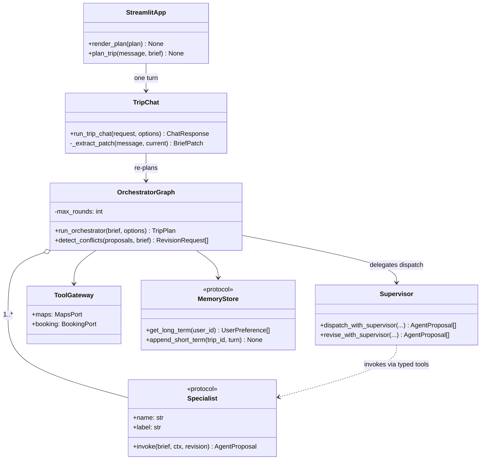
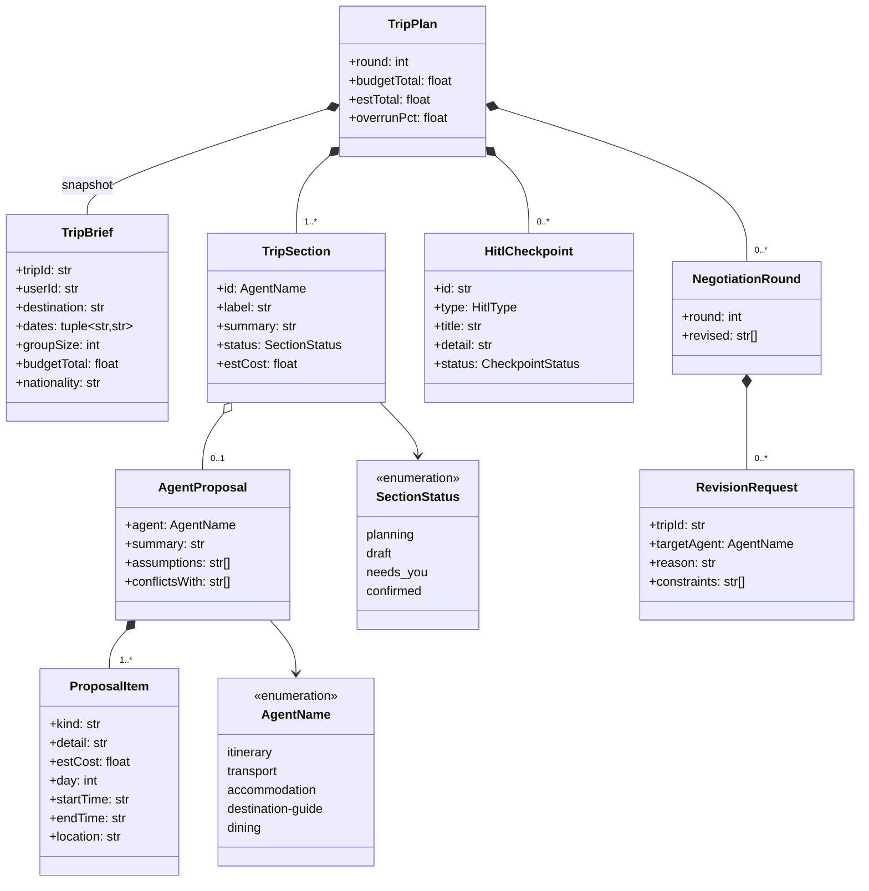
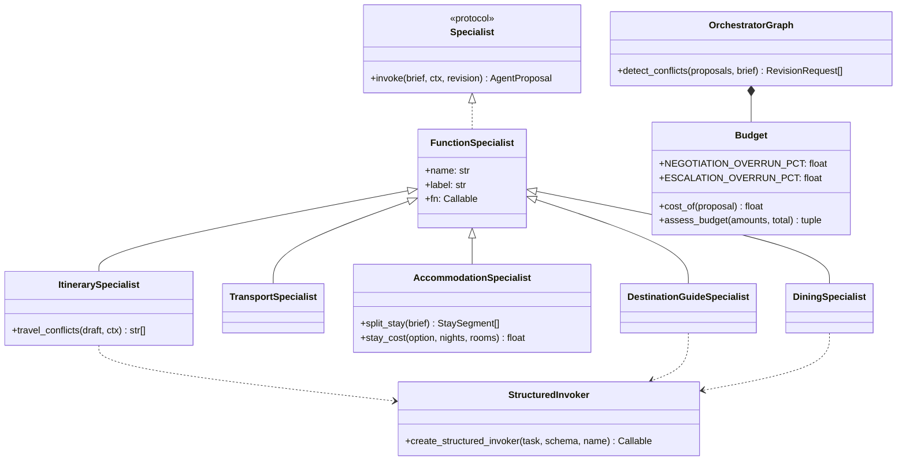
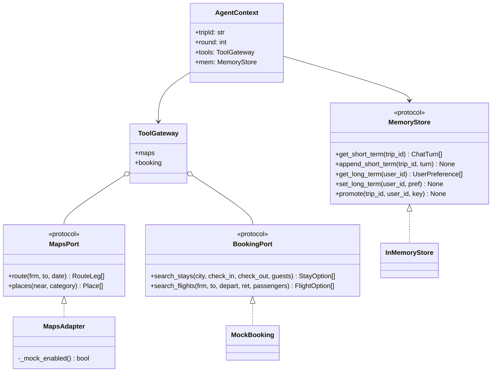

# Class model

The static structure, as Mermaid class diagrams sharing one namespace. Mermaid rather than exported
images: GitHub renders it inline, and a diagram that drifts from the code is worse than none.

Adapted from the TypeScript implementation's design model. The shapes are the same; the names
follow the Python modules.

## Notation

| Line | Meaning | Reads as |
|---|---|---|
| dashed, hollow triangle | realisation | class implements a protocol |
| solid, filled diamond | composition | whole ◆ part; the part cannot outlive the whole |
| solid, hollow diamond | aggregation | whole ◇ part, shared; the part has its own lifetime |
| solid, open arrow | association | source holds a stored reference |
| dashed, open arrow | dependency | transient use — parameter, return or local; no stored field |

---

## Diagram 1 — Structural spine

The load-bearing pieces: the entry point, the chat layer, the orchestrator, the supervisor and the
two protocols injected into every specialist.

`Supervisor` chooses *which* specialists run. It never receives the brief as something it can
rewrite: the tools capture it when they are built.

---

## Diagram 2 — Domain model

The values carried between the UI, the orchestrator and the specialists. Every field is either data
a specialist plans against or something the UI renders.

`TripPlan` composes a copy of the `TripBrief` rather than pointing at a live one: a plan answers one
specific brief, and a later edit must not silently invalidate it.

`ProposalItem` carries `day`, `startTime`, `endTime` and `location` as structured fields precisely
so conflict detection never has to parse a human-readable `detail`.

---

## Diagram 3 — Specialists and orchestration

Transport and accommodation have no line to `StructuredInvoker`: they are deterministic calculators,
so no model is ever in a position to price a stay or a fare.

---

## Diagram 4 — Ports and adapters

`AgentContext` is a specialist's only route out. Nothing imports a concrete adapter, which is why a
test passes a fake and why `USE_MOCK_TOOLS` is a switch rather than a code change.

---

## Key associations

Read *source → target*.

| Source | Target | Type | Mult. | Meaning |
|---|---|---|---|---|
| `StreamlitApp` | `TripChat` | dependency | → 1 | one turn per interaction; no stored planner |
| `TripChat` | `OrchestratorGraph` | association | 1 → 1 | every message re-plans |
| `OrchestratorGraph` | `Specialist` | aggregation | 1 → 1..* | module-level singletons; the graph does not own their lifetime |
| `OrchestratorGraph` | `Budget` | composition | 1 → 1 | private collaborator with no independent identity |
| `OrchestratorGraph` | `ToolGateway` / `MemoryStore` | association | 1 → 1 | injected into every `AgentContext` |
| `Supervisor` | `Specialist` | dependency | → 1..* | reached through typed tools, never stored |
| `TripPlan` | `TripBrief` | composition | 1 → 1 | embeds an immutable snapshot |
| `TripPlan` | `TripSection` | composition | 1 → 1..* | one per specialist |
| `TripPlan` | `NegotiationRound` | composition | 1 → 0..* | why the plan looks the way it does |
| `TripSection` | `AgentProposal` | aggregation | 1 → 0..1 | kept for drill-down |
| `AgentProposal` | `ProposalItem` | composition | 1 → 1..* | a proposal is its line items |
| `ToolGateway` | `MapsPort` / `BookingPort` | aggregation | 1 → 1 | one port of each kind |

## Protocols and implementations

| Protocol | Implemented by | Note |
|---|---|---|
| `Specialist` | the five `FunctionSpecialist` instances | one `invoke` serves both planning and revision |
| `MapsPort` | `MapsAdapter` | fixtures by default, OpenStreetMap when `USE_MOCK_TOOLS=false` |
| `BookingPort` | `MockBooking` | no live provider; fixtures are labelled fictional |
| `MemoryStore` | `InMemoryStore` | process-local for now; a durable store keeps the same signature |

## Design rationale

- **`Specialist` is one protocol with one method.** The orchestrator iterates specialists and calls
  `invoke` without knowing whether a model is involved. That is what lets transport and
  accommodation stay deterministic while the other three reason.
- **Revision reuses the same entry point.** A separate `revise()` would let the two paths drift;
  `revision` is just an optional argument.
- **Budget is composed, not injected.** Thresholds are policy, not configuration, and splitting the
  arithmetic out keeps cost decisions in one place.
- **Ports sit with the contracts, not the adapters.** The core names an interface; only `tools/`
  names an HTTP client, so an external API can change without touching a specialist.
- **`NegotiationRound` is part of the plan.** Round state would otherwise be discarded, and it is
  the only answer to "why is this section marked needs-you".
- **The supervisor holds no trip state.** Its tools close over the brief, so its freedom is
  delegation only — the deterministic rules downstream validate the request, not a paraphrase.
