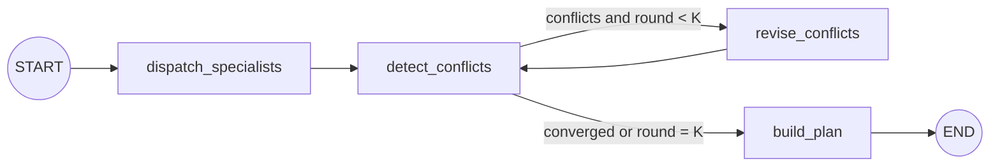

# LangGraph orchestration

The orchestrator is a deterministic LangGraph workflow. LangGraph controls the state transitions;
the five specialist modules implement the framework-neutral `Specialist` protocol. This keeps
budget policy and human checkpoints predictable while still letting individual nodes call a model.



## State

The graph carries `brief`, `round`, `proposals`, `conflicts` and the final `plan`. Input and output
use the Pydantic contracts in `contracts.py`, so the UI and the specialists agree on one shape that
is validated rather than trusted.

## Execution rules

- `dispatch_specialists` runs every registered specialist through `invoke(brief, ctx)`.
- `detect_conflicts` combines three sources: budget overruns, conflicts a specialist declared for
  itself, and cross-agent schedule overlaps derived from structured `day`/`startTime`/`endTime`
  fields rather than parsed from prose.
- `revise_conflicts` re-runs only the targeted specialists, passing an immutable `RevisionRequest`
  through the same entry point. Everything else is carried forward untouched.
- A conditional edge repeats detection and revision up to `max_rounds` (default `3`).
- `build_plan` rolls up cost and produces the HITL checkpoints.
- Specialists, tools, memory and the round limit are injectable through `OrchestratorOptions`, so
  tests run without network or singleton state.

This is intentionally a workflow rather than an unconstrained supervisor agent: the control path,
the budget red lines and the stopping condition should not depend on a model choosing the next
step.

## Why the constraints name their owner

A revising specialist only ever sees its own proposal. An earlier version handed it the conflicting
clock times and nothing else, so the itinerary agent had to guess what to avoid — and in one round
moved an activity onto exactly the transport leg it was supposed to clear. The budget overrun
oscillated 29.25% → 16.50% → 25.25% across three rounds without settling, and every plan ended with
sections marked `needs_you`.

The constraint now names the blocked window and who holds it:

```
on day 4 keep clear of 09:00-11:20, held by transport (Tokyo → Kyoto); reschedule without
changing trip dates
```

With that, the graph converges in round 2 on the demo brief, which also removes a full round of
model calls.

## Budget policy

Money is summed in integer cents, because repeated float addition can drift a total across a policy
threshold. Any overrun is worth negotiating; more than 10% is the red line that escalates to a
human. An unresolved conflict after the final round escalates as well, even below that line.

A specialist returning a nonsense cost is treated as zero rather than failing the plan: the
proposal detail still records what it proposed, and the section simply shows $0.

## Verification

```bash
uv run pytest
uv run ruff check .
```

The tests cover the graph topology and progress events, the round limit, conflict targeting (a
zero-cost specialist is never asked to cut), the constraint wording that makes revision converge,
and the cent-based budget arithmetic.
